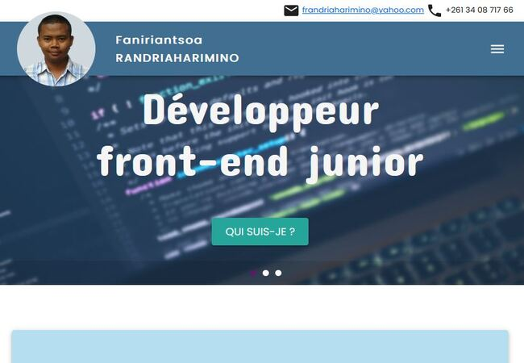

# Faniriantsoa RANDRIAHARIMINO - Front-End Developer

🌐 Location: Madagascar

Welcome to my portfolio! 👋 I'm Faniriantsoa RANDRIAHARIMINO, a junior front-end developer with a passion for new technologies and a fervent explorer of the world of development. My journey as an Agricultural Engineer turned Information System Manager in a ministerial entity has fueled my enthusiasm for technology and paved the way for my transition into development.

<h2>Skills</h2>
<ul>
    <li><strong>Basic Languages:</strong> HTML, CSS, JavaScript</li>
    <li><strong>Front-End Frameworks and Libraries</strong> React.js, Material UI, Bootstrap</li>
    <li><strong>Platform and Version Control:</strong> Firebase, Git, GitHub, GitLab</li>
    <li><strong>CMS and Design Tools: </strong> Photoshop, InDesign, Figma, WordPress</li>
</ul>

<h2>Contact</h2>
<ul>
    <li><strong>📧 Email:</strong> frandriaharimino@yahoo.com</li>
    <li><strong>🔗 LinkedIn:</strong> https://www.linkedin.com/in/faniriantsoa/</li>
    <li><strong>🌐 Portfolio:</strong> https://faniriantsoa-portfolio.firebaseapp.com</li>
    <li><strong>Facebook: </strong> https://web.facebook.com/rfaniriantsoa/</li>
</ul>

<h3>Feel free to reach out for any inquiries or collaboration opportunities!</h3>